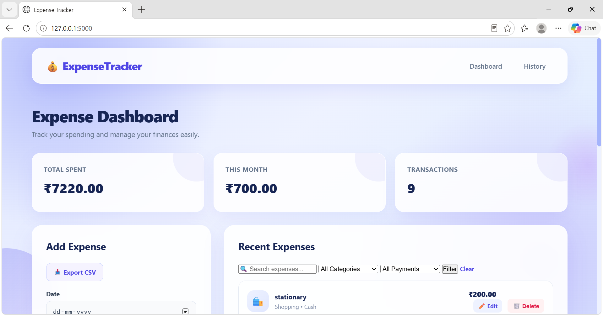
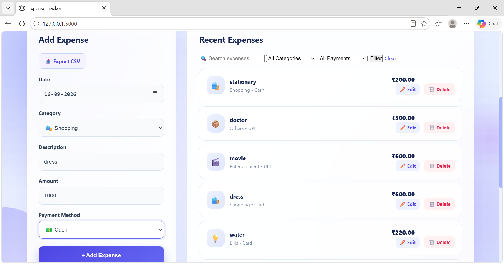
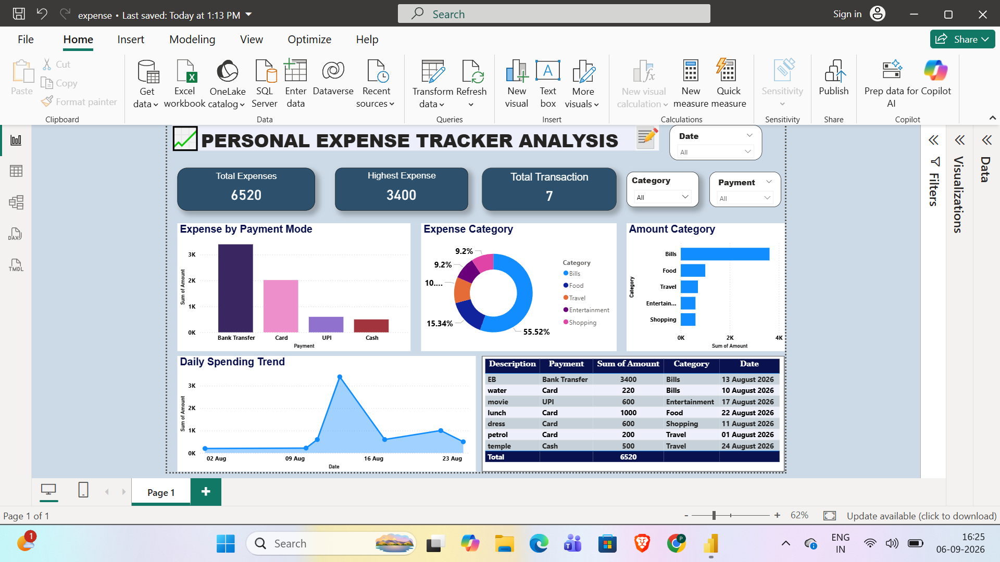

# 💸 ExpenseIQ — Smart Expense Tracking & Analytics

• Personal Expense Tracker is a web-based application built to make everyday expense management more meaningful.

• This makes the project a combination of **web development + data handling + business intelligence**.

---

## 💡 From Expenses to Insights

Small expenses can easily add up without noticing.

simple question:

> **“Can everyday expense data tell us something useful about our spending habits?”**

The application helps organize daily transactions, while Power BI transforms the collected data into visual insights that make spending patterns easier to understand.

**Record → Organize → Analyze → Understand** 📊

> **An expense is just a number until you understand the story behind it.**

---

🧰 Built With

• Python & Flask - Used to build the application and handle the backend logic.

• SQLite - Used to store and manage expense records.

• HTML & CSS - Used to create the structure and visual design of the application.

• Pandas - Used to prepare and work with expense data for analysis.

• Power BI - Used to create interactive dashboards and visualize spending patterns.

## 📸 Project Showcase

### Home page



*A simple view to keep everyday spending organized.*

### Add a New Expense



*Enter the details once and keep the record organized.*

### Dashboard



*Turn individual transactions into visual spending insights.*

## 📂 Project Structure

```text
Personal-Expense-Tracker/
│
├── app.py
├── requirements.txt
├── expense_tracker.db
│
├── templates/
│   ├── index.html
│   ├── add.html
│   └── ...
│
├── static/
│   ├── css/
│   ├── js/
│   └── ...
│
├── screenshots/
│   ├── dashboard.png
│   ├── add-expense.png
│   ├── expense-records.png
│   ├── search-filter.png
│   └── powerbi-dashboard.png
│
└── ...
```
---
## 📊 Turning Data Into a Story

• The application doesn't stop after an expense is saved.

• The collected data can be taken into Power BI and transformed into an interactive dashboard.

### 🔄 The Journey of an Expense

```text
💸 Daily Expense
       ↓
📝 Expense Entry
       ↓
🗄️ SQLite Database
       ↓
📄 Data Preparation
       ↓
📊 Power BI
       ↓
💡 Spending Insights
```
### 👩‍💻 Built By 

**Poornima**
